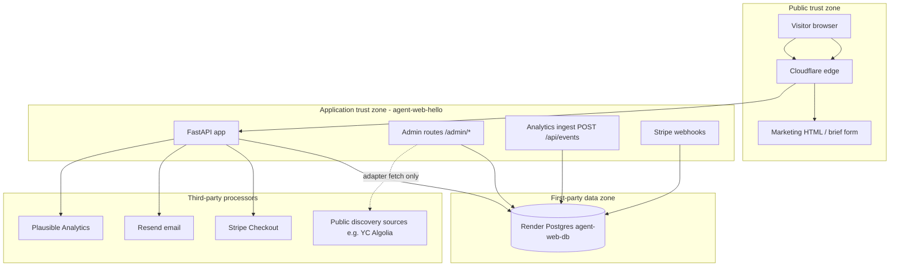
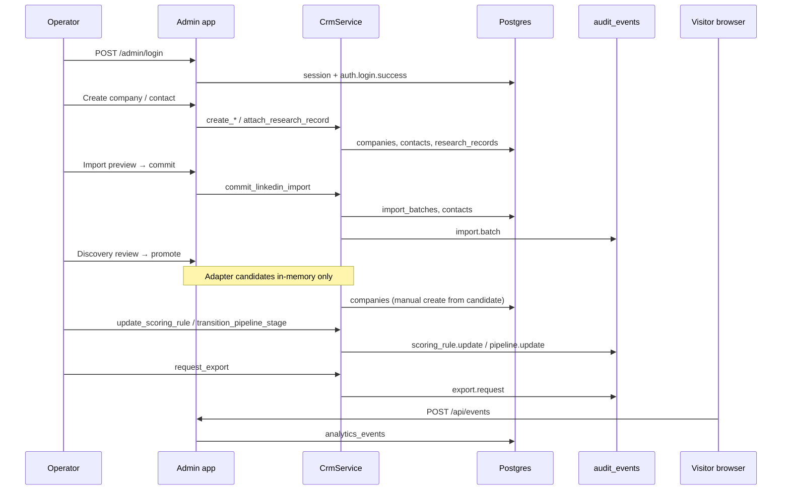

# Architecture and data flow (#130)

Trust boundaries and first-party data ownership for the saberistic.com acquisition
platform. Complements [CRM_SCHEMA.md](CRM_SCHEMA.md) and operational runbooks in
[OPERATIONS_RUNBOOKS.md](OPERATIONS_RUNBOOKS.md).

Parent issue: [#130](https://github.com/saberistic-team/agent-web/issues/130).

## System context

## Trust boundaries

| Boundary | Components | Trust assumption | Controls |
|----------|------------|------------------|----------|
| **Public internet → edge** | Cloudflare, TLS | Visitors are unauthenticated | WAF/DNS; no admin cookies on marketing pages |
| **Edge → app** | Render load balancer, Uvicorn | Proxy headers only from trusted CIDRs | `ADMIN_TRUSTED_PROXY_CIDRS`, `ADMIN_TRUSTED_EDGE_CIDRS`; `--forwarded-allow-ips` in `render.yaml` |
| **App → Postgres** | `DATABASE_URL` | DB network private to Render | Credentials in Render env only; repositories own SQL |
| **Admin session** | `admin_sessions`, CSRF | Single configured operator | Argon2id, rate limits, synchronizer CSRF, append-only audit |
| **Public brief intake** | `POST /api/briefs`, Stripe | Anonymous leads | Stripe handles payment; brief PII in Postgres + email only |
| **Analytics browser → ingest** | `POST /api/events` | Same-origin visitors | Origin check, consent/DNT, rate limits, no PII properties |
| **Discovery → external** | HTTP adapters | Third-party public data only | Size/time limits; candidates never auto-write CRM |

Crossing from **public** to **admin** requires a valid server-side session cookie.
Crossing from **discovery** to **canonical CRM** requires an explicit operator action
(company create, import commit, or brief conversion).

## First-party data ownership

Data the platform controls and is responsible for protecting:

| Domain | Tables / stores | Owner module | PII / sensitive |
|--------|-----------------|--------------|-----------------|
| **Brief intake** | `project_briefs` | `app/db.py` | Email, brief text, website, UTM |
| **CRM entities** | `companies`, `contacts` | `app/repositories/postgres.py` | Names, emails, profile URLs |
| **Provenance** | `source_records`, `import_batches`, `import_batch_rows` | CRM repositories | Import snapshots (profile URLs) |
| **Evidence** | `research_records` | CRM repositories | Operator notes; public evidence URLs |
| **Pipeline** | `companies` pipeline columns, `company_stage_history`, `activities` | `app/acquisition_pipeline.py` | Deal metadata, no payment PAN |
| **Audit** | `audit_events` | `app/audit_service.py` | Redacted summaries only |
| **Admin auth** | `admin_sessions`, `admin_login_flows`, `admin_login_rate_limits` | `app/db.py`, `app/admin_auth.py` | Hashed tokens only |
| **First-party analytics** | `analytics_events`, `analytics_sessions` | `app/analytics_ingest.py` | Opaque session UUIDs; no brief/email |
| **Schema version** | `schema_migrations` | `app/migrations/` | None |

### Not first-party canonical data

| Data | Where it lives | Policy |
|------|----------------|--------|
| Payment card details | Stripe | Never stored locally |
| Email delivery payloads | Resend transit | Templates reference brief id, not full brief in logs |
| Plausible aggregates | Plausible SaaS | Allowlisted props only; no PII |
| Raw discovery fetch bodies | Ephemeral in adapter | Discarded after normalization; optional `raw_payload` on candidate |
| LinkedIn export ZIP | Operator browser | Parsed client-side; only approved rows committed |
| Render/GitHub secrets | Provider dashboards | Not in repository or exports |

## Core acquisition lifecycle (data flow)

Stages map to automated tests in `tests/pg_contract/test_acquisition_lifecycle_e2e.py`.

## Import and recovery boundaries

| Operation | Transaction owner | On failure |
|-----------|-------------------|------------|
| `commit_linkedin_import` | `crm_transaction` | Full rollback; no batch row |
| `rollback_import_batch` | `crm_transaction` | Reverts row-level snapshots |
| `apply_migrations` | `app/migrations/runner.py` | Failed version rolled back; prior schema + data retained |
| Required audit append | Same transaction as mutation | Propagates error → business write rolls back |

Recovery guarantees are tested in `tests/pg_contract/test_acquisition_recovery_e2e.py`.

## Analytics dual path

| Path | Entry | Authoritative for |
|------|-------|-----------------|
| **Plausible** | `site/assets/analytics.js` + server emitters | Marketing funnel KPIs, UTM dashboards |
| **First-party** | `site/assets/first_party_analytics.js` → `POST /api/events` | Durable same-origin event store in Postgres |

Server-authoritative conversion events (`Lead Persisted`, `Checkout Opened`,
`Payment Completed`) are emitted from `app/main.py` / `app/server_analytics.py`
and must not be accepted from the browser ingest endpoint.

## Security reporting contacts

- Admin auth anomalies: `/admin/audit` + `auth.*` actions
- Data integrity: `scripts/crm_backup.py verify`
- Deploy health: `/health` + `scripts/smoke_deploy.py`

## Related documentation

- [CRM_SCHEMA.md](CRM_SCHEMA.md) — table definitions and migration policy
- [AUDIT_EVENTS.md](AUDIT_EVENTS.md) — append-only audit and retention
- [ADMIN_AUTH.md](ADMIN_AUTH.md) — session and CSRF lifecycle
- [ANALYTICS_INGEST.md](ANALYTICS_INGEST.md) — first-party ingest contract
- [BACKUP_RESTORE.md](BACKUP_RESTORE.md) — recovery procedures
- [OPERATIONS_RUNBOOKS.md](OPERATIONS_RUNBOOKS.md) — operator commands
