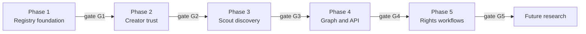

# WorldGraph — Phase roadmap

**Parent issue:** [#203](https://github.com/saberistic-team/agent-web/issues/203)

**Status:** Gated phase plan. Only **Phase 1** decomposes into engineering issues after
PRD owner approval. Later phases require validation gates — not fixed date promises.

**Last updated:** 2026-07-22

**PRD:** [PRD_MVP.md](./PRD_MVP.md)

---

## Overview

WorldGraph MVP delivery splits into five gated phases plus future research. Each phase
ends with explicit **exit criteria** before the next phase is funded.

---

## Proposed implementation milestone names

These names are for planning and issue grouping only. **Do not create GitHub
milestones** until owner approves the PRD and Phase 1 issues are opened.

| Milestone name | Phase | Scope summary |
|----------------|-------|---------------|
| `WorldGraph Phase 1 — Registry Foundation` | 1 | Manifest, private drafts, admin review, ingestion worker |
| `WorldGraph Phase 2 — Creator Trust & Profiles` | 2 | Claim workflows, creator correction, public profiles |
| `WorldGraph Phase 3 — Scout Discovery` | 3 | Search, filters, primary actions, analytics |
| `WorldGraph Phase 4 — Relationship Graph & Developer API` | 4 | Linked entities, read API, exports |
| `WorldGraph Phase 5 — Rights & Licensing Workflows` | 5 | Conditional; only if demand validated |

Existing repo milestone **WorldGraph Product Definition** ([#9](https://github.com/saberistic-team/agent-web/milestone/9))
covers definition work through this PRD. Implementation milestones are separate.

---

## Phase 1 — Manifest, private drafts, and admin review

**Goal:** Operator-assisted pipeline from URL to reviewed private draft with valid
Manifest v0 snapshot — no public profiles or search.

### In scope

- Postgres migrations: `worlds`, `world_manifest_snapshots`, `world_sources`,
  `world_field_evidence`, `ingestion_jobs` ([ADR](./ADR_INGESTION_AND_SEARCH.md))
- Repository protocols mirroring CRM patterns
- Render background worker: bounded fetch, deterministic extract, validate
- Admin UI: draft queue, extraction review, qualification/duplicate/safety checklist,
  reject with reason
- Audit events (`entity_type=world`)
- Spike security baseline (SSRF, size cap, injection defense)
- `ADMIN_PREVIEW_MODE` mock data for admin screens

### Out of scope

- Public `/worlds` routes
- Creator self-serve claim
- Search index
- Model-assisted extraction (optional flag off)

### Engineering issue themes (proposed, not yet filed)

1. Schema migration + repositories
2. Ingestion worker + job API
3. Admin worlds list + draft detail
4. Manifest validation + provenance display
5. Qualification rules engine + negative control tests

### Exit criteria (Gate G1)

| Criterion | Measure |
|-----------|---------|
| End-to-end admin draft | URL → job → snapshot → admin approve/reject on staging |
| Schema validity | 100% pilot fixtures produce valid manifest or explicit exclusion |
| Security regressions | Adversarial fixtures pass CI |
| No CRM leakage | Zero writes to `project_briefs` from world flows |
| Ops readiness | Runbook draft for review queue |

**Gate G1 approvers:** Product owner + engineering lead.

---

## Phase 2 — Creator claim and public profiles

**Goal:** Verified creators correct manifests; admin publishes public profiles with
machine-readable JSON.

### In scope

- Claim workflows: domain well-known/DNS, GitHub ownership, email fallback
- Creator correction UI with `creator_declared` provenance
- Publish/unpublish lifecycle
- Public profile page + manifest JSON URL
- Trust-labeled field presentation
- Stale/reverification job skeleton (fetch scheduling)

### Out of scope

- Public search index
- Semantic embeddings
- Creator billing

### Dependencies

- Gate G1 complete
- [#202](https://github.com/saberistic-team/agent-web/issues/202) supply signal: ≥70%
  concierge creators complete claim (or owner waiver)

### Exit criteria (Gate G2)

| Criterion | Measure |
|-----------|---------|
| Claim methods | Domain + GitHub challenges pass integration tests |
| Publish path | Admin publishes ≥3 staging worlds with creator attestation |
| Unpublish | Public 404 + audit within 60 s |
| Trust UI | Every field cluster shows source kind + verification tier |
| Concierge pilot | ≥10 consenting projects reviewed (per #202 plan) |

---

## Phase 3 — Structured and semantic discovery

**Goal:** Scouts find and compare published worlds; primary outbound actions work;
privacy-preserving analytics live.

### In scope

- `world_search_documents` + FTS/trigram index
- Public search UI + structured filters
- Minimum score threshold for negative intents
- Primary actions: enter, integrate, source, contact
- Analytics events (bucketed; no raw query PII)
- No-result refinement UX
- Public index flag when corpus gate met (≥20 published worlds)

### Out of scope

- pgvector (unless Gate G3b triggered — see below)
- Paid placement
- Consumer personalization

### Dependencies

- Gate G2 complete
- [#202](https://github.com/saberistic-team/agent-web/issues/202) demand signal: ≥80%
  discovery task completion (or owner waiver)

### Exit criteria (Gate G3)

| Criterion | Measure |
|-----------|---------|
| Search quality | 0% no-result on curated qualifying query set ([queries.json](./spike/queries.json)) |
| Negative suppression | Engine/chatbot negative queries return 0 qualifying hits |
| Outbound actions | All four action types instrumented |
| Analytics privacy | Schema review sign-off |
| Pilot corpus | ≥20 published worlds |

### Optional Gate G3b — semantic search spike

Proceed to pgvector/hybrid only if **both**:

- Published corpus > ~5,000 worlds, **or**
- Lexical no-result rate > 15% on scout queries for 30 days

Otherwise defer to Phase 4 planning review.

---

## Phase 4 — Relationship graph and developer API

**Goal:** Model linked platforms, agents, creators, and assets; expose read API for
scouts and integrators.

### In scope

- Normalized links from manifest `world_structure` to graph edges
- Read-only API: world by slug, search, manifest export
- API keys for scout teams (rate limited)
- Versioned manifest history endpoint

### Out of scope

- Write API for third parties
- Cross-world identity
- Agent migration

### Dependencies

- Gate G3 complete
- Retention signal: ≥40% discovery participants report recurring scout job (#202)

### Exit criteria (Gate G4)

| Criterion | Measure |
|-----------|---------|
| API stability | OpenAPI spec + integration tests |
| Graph coverage | ≥80% published worlds have ≥1 linked entity when manifest declares it |
| Usage | ≥3 external API consumers in pilot (manual onboarding) |

---

## Phase 5 — Rights and licensing workflows

**Goal:** Structured rights inquiry and workflow support **only if validated demand**.

### Conditional scope

- Rights request form routed to creator
- License compatibility filters enhanced
- Private scout workspace (subscription hypothesis)

### Dependencies

- Gate G4 complete
- [#202](https://github.com/saberistic-team/agent-web/issues/202) monetization signal:
  ≥1 segment ranks rights/licensing or private scouting package with budget owner

### Exit criteria (Gate G5)

| Criterion | Measure |
|-----------|---------|
| Demand proof | ≥5 rights inquiries completed in pilot |
| Legal review | Workflow copy approved |
| No escrow | No payment or contract execution in product |

If demand is **not** validated, Phase 5 pauses indefinitely; registry remains
discovery + contact only.

---

## Future research (ungated)

Track but do not commit engineering:

| Theme | Trigger to revisit |
|-------|-------------------|
| Interoperability (MSF Web of Worlds alignment) | External standard adoption curve |
| Economy (tokens, marketplace) | Explicit invalidation of MVP non-goals lifted by owner |
| Governance execution | Separate product decision |
| World-to-world actions | Phase 4 API usage + partner demand |
| Consumer personalization | Corpus > 1k worlds + moderation ops |
| Autonomous crawling | Legal/policy review + creator opt-in model |

---

## Validation gates summary

| Gate | Blocks | Required evidence |
|------|--------|-------------------|
| **PRD approval** | All engineering issues | Owner sign-off in [DECISION_LOG.md](./DECISION_LOG.md) |
| **G1** | Phase 2 | Phase 1 exit criteria |
| **G2** | Phase 3 | Supply validation (#202) or owner waiver |
| **G3** | Phase 4 | Demand validation (#202) or owner waiver |
| **G3b** | pgvector | Corpus scale or no-result rate |
| **G4** | Phase 5 | Retention + API pilot |
| **G5** | Rights workflows | Monetization validation |

---

## Invalidation triggers (from market position)

Revisit or stop the roadmap if any [#198](./MARKET_POSITION.md) invalidation
condition becomes true — especially mandatory platform manifests, creator refusal
to register, or scout preference for existing registries.

---

## Related documents

- [PRD_MVP.md](./PRD_MVP.md)
- [DECISION_LOG.md](./DECISION_LOG.md)
- [RELEASE_MEASUREMENT_CHECKLIST.md](./RELEASE_MEASUREMENT_CHECKLIST.md)
- [TECHNICAL_SPIKE.md](./TECHNICAL_SPIKE.md)
- [ADR_INGESTION_AND_SEARCH.md](./ADR_INGESTION_AND_SEARCH.md)
