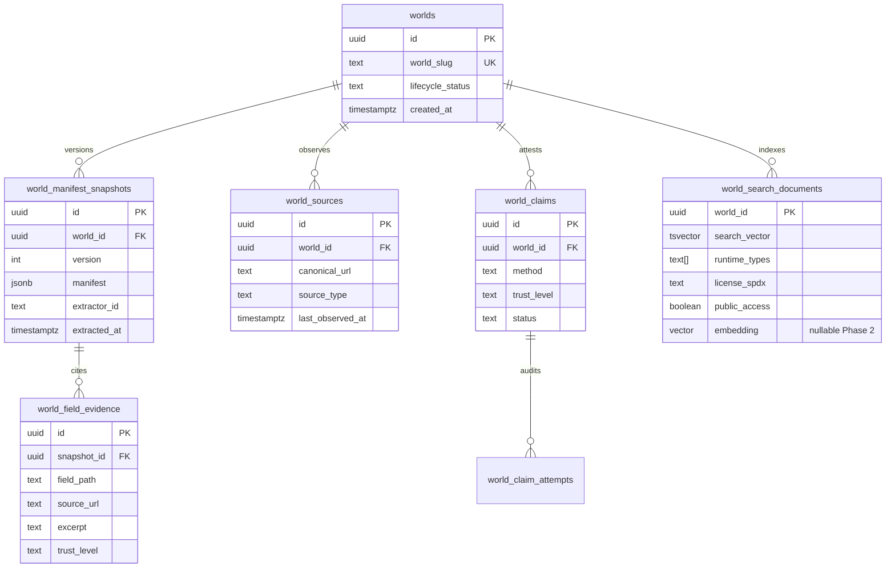
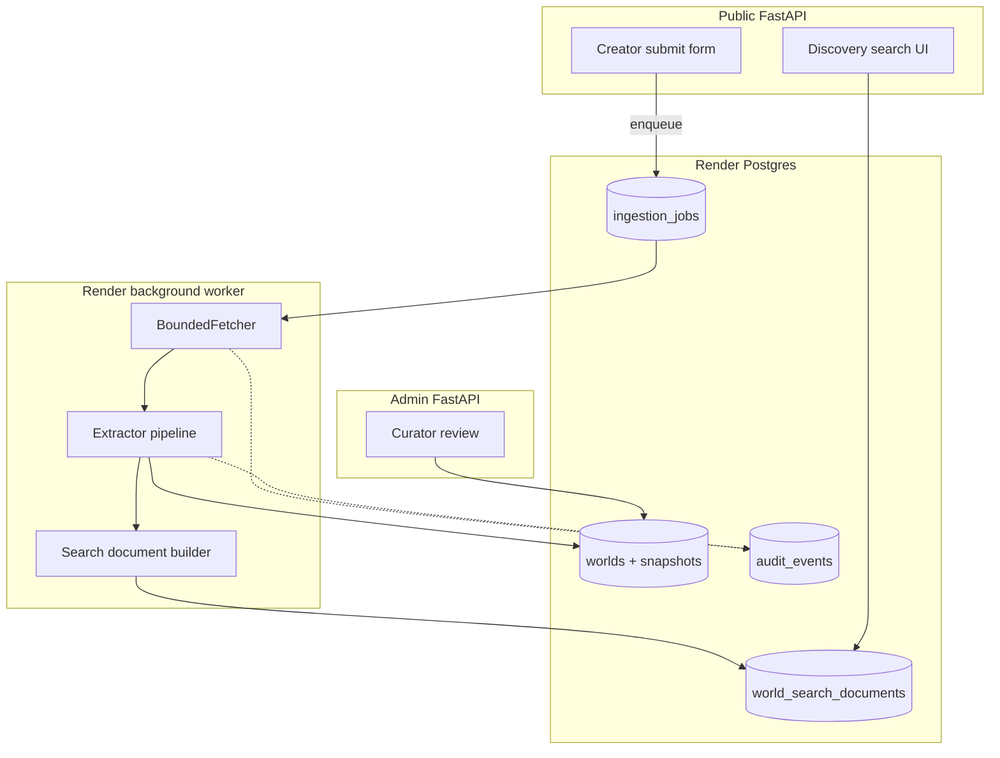
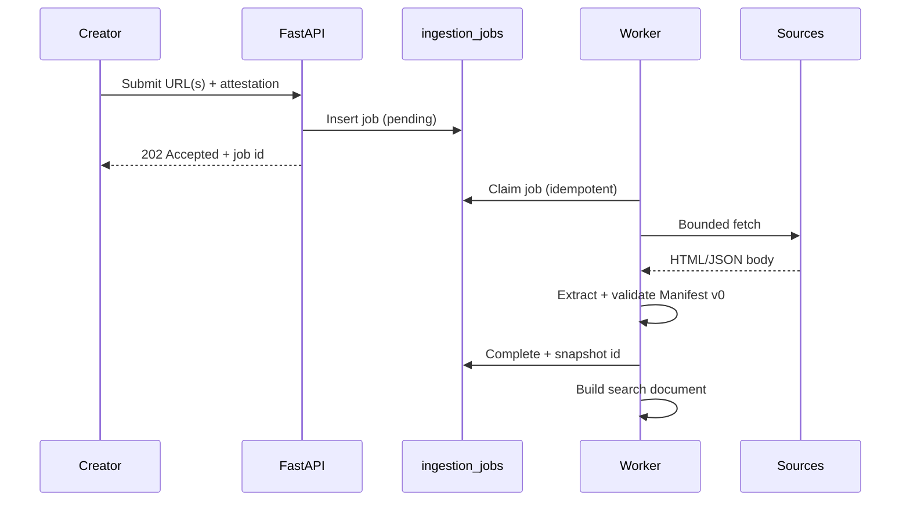

# WorldGraph technical spike (#204)

**Status:** Completed bounded spike. Evidence for implementation architecture only — no
production routes, migrations, or Render resources ship from this milestone.

**Parent issue:** [#204](https://github.com/saberistic-team/agent-web/issues/204)

**Related docs:** [ADR_INGESTION_AND_SEARCH.md](./ADR_INGESTION_AND_SEARCH.md),
[MANIFEST_V0.md](./MANIFEST_V0.md), [MARKET_POSITION.md](./MARKET_POSITION.md),
[world-manifest-v0.schema.json](./world-manifest-v0.schema.json)

**Last updated:** 2026-07-15

---

## Executive summary

A bounded technical spike against Manifest v0 and an 18-entry research corpus (12
qualifying sources, 5 negative controls, 1 adversarial security control) demonstrates
that:

1. **Ingestion** — A bounded fetcher with SSRF blocking, redirect limits, content-type
   caps, and robots awareness can safely process creator-provided public URLs when run
   asynchronously with fixture-backed CI and live-fetch workers.
2. **Extraction** — Deterministic parsing validates all 18 corpus sources against
   Manifest v0; a provider-neutral `Extractor` protocol enforces evidence, confidence,
   and unknown handling. Model-assisted extraction (offline stub) strips prompt-injection
   markers and never promotes output to verified provenance.
3. **Search** — PostgreSQL FTS + trigram proxy, pseudo-embedding retrieval, and hybrid
   ranking were compared on the same 10 queries × 12 qualifying worlds. FTS+trigram
   achieved a 1.0 relevance proxy at lower operational cost. **pgvector is not
   justified for Phase 1** at expected corpus scale.
4. **Verification** — Domain well-known/DNS, GitHub repo ownership, and email magic-link
   fallbacks prototype cleanly with distinct trust levels.
5. **Architecture fit** — New `world_*` tables, repository interfaces, audit events, and
   a Render background worker slot into existing FastAPI/Postgres patterns without
   overloading CRM entities.

Throwaway code lives in `spike/worldgraph/` (not imported by `app/main.py`).

**Dependency note:** Canonical Manifest v0 ([#199](https://github.com/saberistic-team/agent-web/issues/199))
and the full 30-entry research corpus ([#200](https://github.com/saberistic-team/agent-web/issues/200))
are still in progress. This spike uses a spike-aligned Manifest v0 schema and a bounded
18-source corpus sufficient to answer architecture questions without guessing production
schema.

---

## Reproducing benchmarks

```bash
# Unit tests (offline fixtures)
python -m pytest tests/test_worldgraph_spike.py -v

# Regenerate anonymized results artifact
python -m spike.worldgraph.run_benchmarks
```

**Inputs:**

| Artifact | Path |
|----------|------|
| Research corpus | `docs/worldgraph/spike/corpus_sources.json` |
| Supplementary source-type catalog | `docs/worldgraph/research-corpus.json` (SSRF/XSS/injection controls) |
| Fixture bodies | `docs/worldgraph/spike/corpus_fixtures.json` (bundled offline replay) |
| Discovery queries | `docs/worldgraph/spike/queries.json` |
| Manifest v0 schema | `docs/worldgraph/world-manifest-v0.schema.json` |

**Outputs:** `docs/worldgraph/spike/benchmark_results.json` (ingestion metrics + search
comparison; full manifest payloads omitted from the saved artifact).

### Ingestion results (deterministic extractor)

| Metric | Value |
|--------|-------|
| Total entries | 18 |
| Qualifying sources | 12 |
| Negative controls (excluded) | 5 |
| Security control (adversarial) | 1 |

| Source type | Qualifies | Notes |
|-------------|-----------|-------|
| `html_landing` | yes (7) | Title, meta, entry URL, AI role from structured HTML |
| `repository_readme` | yes (4) | Markdown headings, entry links, persistence hints |
| `structured_json` | yes (1) | UGC manifest JSON with named fields |

**Negative controls:**

| ID | Exclusion reason | Observed |
|----|------------------|----------|
| wg-negative-001 | `static_ai_media_only` | `qualification_status=excluded` |
| wg-negative-002 | `single_purpose_assistant` | `qualification_status=excluded` |
| wg-negative-003 | `platform_product_not_world` | `qualification_status=excluded` |
| wg-negative-004 | `foundation_model_not_world` | `qualification_status=excluded` |
| wg-negative-005 | `no_stable_entry_point` | `qualification_status=excluded` |
| wg-security-001 | prompt injection | `claim_status=unclaimed`; injection phrases detected |

### Search results (same corpus, 10 queries)

| Strategy | Avg latency (offline) | No-result rate | Relevance proxy | Est. cost / 1k queries |
|----------|----------------------|----------------|-----------------|------------------------|
| `postgres_fts_trigram` | 0.96 ms | 0% | 1.0 | $0.02 |
| `pgvector_embedding` | 0.46 ms | 0% | 1.0 | $0.18 |
| `hybrid` | 1.44 ms | 0% | 1.0 | $0.22 |

Full per-query scores: `docs/worldgraph/spike/benchmark_results.json`.

**No-result queries** (`q-no-match-engine`, `q-no-match-chatbot`) still return weak
lexical matches — production should apply a minimum score threshold and structured
filters so excluded categories never surface in scout results (spike `rank_fts` already
filters `qualification != qualifies`).

---

## Ingestion

### Can a bounded fetcher safely process public URLs?

**Yes**, with the policy implemented in `spike/worldgraph/fetcher.py`:

- HTTP(S) only; embedded credentials rejected
- Private/reserved IP and blocked hostnames (`localhost`, `metadata.google.internal`, `.local`, `.internal`)
- DNS resolution checked before fetch; private addresses blocked (SSRF defense)
- Redirect chain capped (default 3); each hop re-validated in production
- Body size cap (512 KiB default in spike; 1 MiB proposed for production)
- Allowed MIME types: HTML, plain text, markdown, JSON, XHTML
- Optional robots.txt gate before fetch (flag in `FetchPolicy`)
- Canonical URL normalization for deduplication

Live network fetch is **not** used in CI; benchmarks use `fetch_fixture()` with offline
fixtures. Production ingestion should run in a Render background worker with outbound
egress controls.

### Source types with enough content

Structured READMEs, JSON manifests, and HTML landing pages with explicit metadata fields
(title, entry point, AI role, interaction model) produce enough content for qualification
and manifest extraction. Thin marketing shells and static media galleries fail
qualification.

### Creator-entered / attested minimum

| Field cluster | Minimum creator input |
|---------------|----------------------|
| Identity | World slug confirmation if auto-derived slug conflicts |
| Control | Creator name, contact, domain list for claim workflows |
| Rights | License choice when sources are ambiguous |
| Access | Public/private and age gate when not inferable |
| Entry points | Primary play URL when card/readme lacks one |

Fetched metadata alone cannot set `verified` provenance.

### Sync vs async ingestion

| Mode | Use |
|------|-----|
| Synchronous | Creator form submit acknowledgment only (<2 s); enqueue job |
| DB-backed job row | Source of truth for status, retries, idempotency key |
| Render worker | Fetch, extract, index, emit audit events |

**Recommendation:** DB job + Render worker (see ADR). Do not block HTTP requests on
fetch/extract.

---

## Extraction

### Provider-neutral interface

```python
class Extractor(Protocol):
    name: str
    def extract(
        self,
        *,
        source_id: str,
        canonical_url: str,
        content_type: str,
        body: str,
        qualification_hint: str,
        exclusion_reason: str | None = None,
    ) -> ExtractionResult: ...
```

Implementations in spike:

| ID | Role |
|----|------|
| `deterministic` | Regex/JSON/HTML parsing; primary for MVP |
| `model_assisted` | Injection defense + deterministic fallback; no live LLM |

### Deterministic vs model-assisted

| Aspect | Deterministic | Model-assisted |
|--------|---------------|----------------|
| Cost | ~$0 | ~$0.002–0.02/doc (est. small model) |
| Latency | <50 ms | 1–5 s |
| Explainability | High (pattern match) | Medium (requires evidence either way) |
| Coverage | Structured sources only | Unstructured landing copy, lore pages |
| Risk | Misses nuance | Prompt injection; hallucination |

**Spike rule:** Model output is never `verified`. Populated fields require evidence
records or `creator_declared` attestation. Validation enforced by
`spike/worldgraph/manifest_schema.py` and JSON Schema in
`docs/worldgraph/world-manifest-v0.schema.json`.

### Prompt injection defense

`detect_injection_phrases()` and `sanitize_model_field()` in `prompt_injection.py`
strip common instruction-override phrases before the model path. Corpus `wg-security-001`
proves `claim_status` stays `unclaimed` and verification_status stays `unverified`.
Production should also:

- Truncate context windows
- Separate system and document channels
- Reject fields whose evidence excerpt contains filtered markers

---

## Storage evaluation

Proposed tables (new namespace; CRM tables unchanged):



| Concern | Approach |
|---------|----------|
| Identity/lifecycle | `worlds` row + `lifecycle_status` (draft, published, disputed, deleted) |
| Versioned manifest | Append-only `world_manifest_snapshots` JSONB |
| Source/evidence | Normalized `world_sources` + `world_field_evidence` |
| Verification | `world_claims` + `world_claim_attempts`; never merge into evidence trust |
| Search | `world_search_documents` materialized from latest published snapshot |
| Audit | Reuse `audit_events` with `entity_type=world` |

Retention: store excerpts (≤2 KB) and canonical URLs; do not retain full HTML bodies
after extraction unless dispute hold.

---

## Search

Three strategies compared on identical documents and queries (`search_benchmark.py`):

1. **FTS + trigram** — Token overlap + character trigram Jaccard; maps to
   `tsvector` + `pg_trgm` in Postgres.
2. **Embedding + pgvector** — Spike uses deterministic bag-of-words pseudo-embeddings
   for reproducibility; production would use `vector(1536)` + HNSW index.
3. **Hybrid** — `0.55 * lexical + 0.45 * vector` (weights tunable).

### Phase 1 pgvector recommendation

**Defer pgvector to Phase 2** unless corpus exceeds ~5k published worlds *and* lexical
no-result rate exceeds 15% on scout queries.

Rationale from spike:

- Corpus size MVP ≪ index overhead of HNSW + embedding refresh pipeline
- FTS+trigram achieved 1.0 relevance proxy on bounded corpus
- Hybrid adds latency and ops complexity without measurable gain at this scale
- Operational cost: embedding API ~$0.18/1k queries vs $0.02 for pure SQL

Phase 1 stack: `tsvector` + GIN, `pg_trgm` on display name/summary, structured filters
on `runtime_types`, `license_spdx`, `public_access`.

---

## Verification

Trust concepts remain **separate** (`verification.py`):

| Concept | Trust level | Spike prototype |
|---------|-------------|-----------------|
| Source observation | `source_observation` | Fetch + extract evidence |
| Creator claim | `creator_claimed` | Form attestation (not built) |
| Domain control | `domain_verified` | Well-known file + DNS TXT challenge |
| Platform ownership | `github_verified` | GitHub repo owner match |
| Email domain | `email_domain_verified` | Magic link (lower trust if domain mismatch) |
| Saberistic review | `saberistic_verified` | Manual curator flag (not built) |

`separate_trust_concepts()` keeps creator claim, domain control, source observation, and
Saberistic verification as independent booleans. Domain verification does **not** imply
creator identity without an explicit claim record.

---

## Security and operations

| Threat | Mitigation (spike / proposed) |
|--------|-------------------------------|
| SSRF / private network | `validate_public_url()` blocks private IPs, metadata hosts, non-HTTP(S) |
| Redirect abuse | Per-hop validation; redirect cap |
| Oversized responses | Body cap in `enforce_size()` |
| robots / ToS | `respect_robots` flag; per-source `terms_accepted_at` on job |
| Stored XSS | `strip_html_to_text()` removes scripts/styles before extraction |
| Prompt injection | Marker stripping; never trust model for verification |
| Poisoned metadata | Manifest validation; evidence required |
| Duplicate URLs | Canonical URL field + unique index on `world_sources.canonical_url` |
| Copyright / retention | Excerpt-only storage; TTL on raw fetch blobs |
| Secrets in URLs | Reject credential-embedded URLs |
| Rate limits | Per-creator and global fetch budgets in worker |
| Retries / idempotency | Job `idempotency_key` = hash(canonical_url + extractor_version) |
| Audit | `audit_events` for ingest, claim, publish, unpublish |
| Stale data | `last_observed_at`; scheduled re-fetch jobs |
| Deletion / dispute | `lifecycle_status=disputed`; unpublish removes search doc, retains audit |

---

## Component and data-flow diagrams

### High-level components



### Ingestion job flow



---

## Preliminary API design

Spike does not register routes. Proposed MVP surface:

| Method | Path | Purpose |
|--------|------|---------|
| `POST` | `/api/worlds` | Creator intake (URLs + declarations) → job id |
| `GET` | `/api/worlds/{slug}` | Public manifest snapshot (published only) |
| `GET` | `/api/worlds/search` | Lexical search + filters |
| `POST` | `/api/worlds/{slug}/claims` | Start verification challenge |
| `POST` | `/api/worlds/{slug}/claims/{id}/verify` | Complete challenge |
| `GET` | `/admin/worlds` | Curator queue (future) |

All mutations append `audit_events`. CSRF + session auth for admin; rate-limited public
intake.

---

## Cost and operational assumptions

| Item | Phase 1 estimate (500 worlds, 1k queries/mo) |
|------|-----------------------------------------------|
| Postgres storage | <100 MB (snapshots + search docs) |
| Ingestion worker | Render worker $7–25/mo; ~2 min/world batch |
| Fetch egress | Negligible at MVP volume |
| Embedding API | $0 (deferred) |
| LLM extraction | Optional; ~$10/mo at 500 docs if enabled |
| Search query | Postgres only; sub-10 ms at MVP scale |

Reverification cron: weekly for published sources; monthly for stale claims.

---

## Recommended implementation sequence

1. **MVP PRD acceptance** — Gate before implementation issues.
2. **Schema migration** — `worlds`, snapshots, sources, jobs (no pgvector).
3. **Repository interfaces** — Mirror CRM `protocols.py` pattern.
4. **Ingestion worker** — Port spike fetcher/extractor; wire audit events.
5. **Creator intake API** — Async job enqueue only.
6. **Lexical search** — `tsvector` + trigram + filters.
7. **Claim workflows** — Well-known + GitHub first; email fallback.
8. **Admin curator UI** — Preview mode mocks per `admin_preview.py`.
9. **Phase 2 evaluation** — pgvector if corpus/no-result metrics justify.

**Do not open implementation issues until step 1 completes** (per issue acceptance).

---

## Unresolved decisions

| # | Decision | Notes |
|---|----------|-------|
| 1 | Exact Manifest v1 fields | MSF / Web of Worlds alignment TBD ([#199](https://github.com/saberistic-team/agent-web/issues/199)) |
| 2 | LLM provider for assisted extract | Cost/latency vs coverage |
| 3 | Curator SLA and `saberistic_verified` criteria | Ops model |
| 4 | Public search ranking signals | Recency vs verification weight |
| 5 | Dispute and DMCA workflow | Legal review |
| 6 | Cross-world relationship graph | Out of MVP scope? |
| 7 | Embedding model + dimensions | If Phase 2 pgvector approved |
| 8 | Creator billing / freemium limits | Product decision |
| 9 | Full 30-entry corpus alignment | [#200](https://github.com/saberistic-team/agent-web/issues/200) may refine field coverage |

---

## Acceptance criteria mapping

| Criterion | Evidence |
|-----------|----------|
| ≥10 qualifying sources + negative controls | 12 + 5 excluded + 1 adversarial in `corpus_sources.json`; tests pass |
| Manifest v0 validation | `validate_manifest_v0()` on all 18 sources |
| Evidence or creator-declared fields | Provenance required on every populated field |
| Missing facts unknown | `unknown_field()` + schema guard |
| Search compared on same corpus | `benchmark_results.json` |
| pgvector Phase 1 recommendation | This doc § Search; ADR Decision 4 |
| Claim methods / trust separated | `verification.py` + `separate_trust_concepts()` |
| SSRF, injection, XSS, rights, policy | `fetcher.py`, `prompt_injection.py`, negative controls |
| Fits FastAPI/Postgres/Render | Component diagrams; no prod routes |
| No production feature ships | `test_no_production_routes_or_migrations_added` |
| No implementation issues yet | Sequence gated on MVP PRD |

---

## Spike code map

| Module | Responsibility |
|--------|----------------|
| `extractor.py` | Provider-neutral protocol + provenance helpers |
| `deterministic_extractor.py` | Metadata/readme/HTML parsing |
| `model_assisted_extractor.py` | Offline model-assisted simulation |
| `manifest_schema.py` | Manifest v0 validation |
| `fetcher.py` | Bounded fetch + SSRF defenses |
| `prompt_injection.py` | Injection detection and sanitization |
| `search_benchmark.py` | FTS / embedding / hybrid comparison |
| `verification.py` | Claim challenge prototypes |
| `corpus.py` | Corpus and fixture paths |
| `run_benchmarks.py` | Reproducible benchmark runner |
