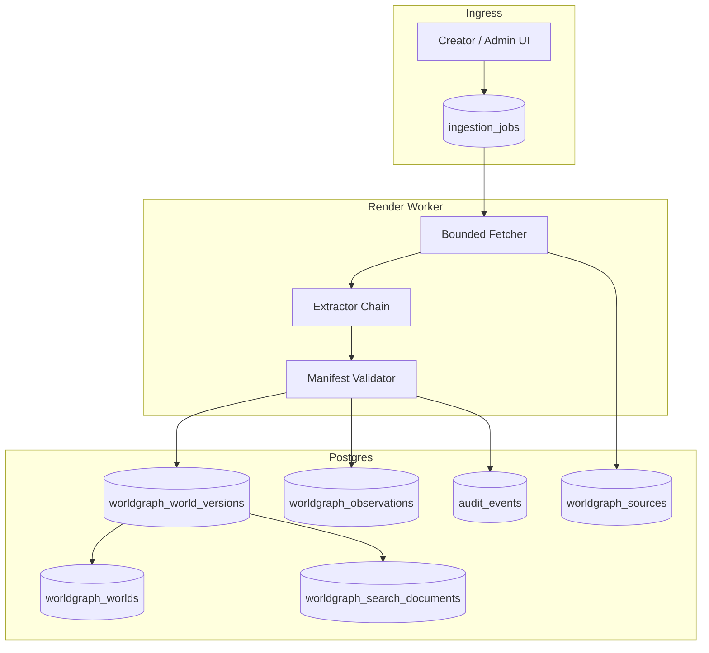
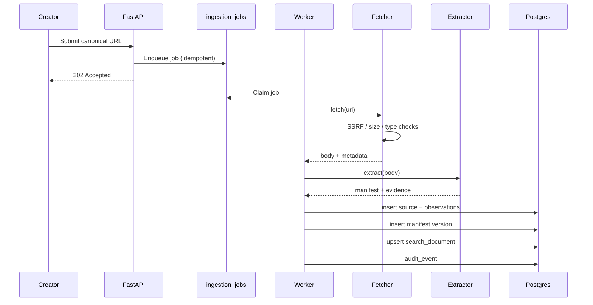

# WorldGraph technical spike (issue #204)

Research-only bounded spike against Manifest v0 and a synthetic research corpus. **No production routes, migrations, dependencies, or Render resources ship from this milestone.**

## Dependency note

Canonical Manifest v0 and the full research corpus are tracked in issues [#199](https://github.com/saberistic-team/agent-web/issues/199) and [#200](https://github.com/saberistic-team/agent-web/issues/200). This spike uses a **bounded spike corpus** (`docs/worldgraph/spike/`) aligned to the #199 field model so ingestion, validation, and search can be exercised before those docs issues merge.

## Spike artifacts

| Artifact | Path |
|----------|------|
| Manifest v0 JSON Schema (spike-aligned) | `docs/worldgraph/world-manifest-v0.schema.json` |
| Bounded corpus metadata | `docs/worldgraph/spike/corpus_sources.json` |
| Offline source fixtures | `docs/worldgraph/spike/fixtures/sources/` |
| Discovery queries | `docs/worldgraph/spike/queries.json` |
| Anonymized benchmark output | `docs/worldgraph/spike/benchmark_results.json` |
| Isolated experimental code | `spike/worldgraph/` |
| Unit tests | `tests/test_worldgraph_spike.py` |

Reproduce benchmarks:

```bash
python -m spike.worldgraph.run_benchmarks
python -m pytest tests/test_worldgraph_spike.py -v
```

## Corpus summary

| Group | Count | Purpose |
|-------|------:|---------|
| Qualifying worlds | 12 | Narrative, spatial, simulation, game, social, hybrid, open-source |
| Negative controls | 5 | Static media, chatbot, engine, foundation model, marketing-only |
| Security control | 1 | Prompt-injection adversarial README |
| **Total sources tested** | **18** | Meets ≥10 qualifying + negative-control acceptance |

Source types exercised: HTML landing pages, repository/readme markdown, structured JSON manifests.

## Ingestion findings

### Can a bounded fetcher safely process public URLs?

**Yes, with strict policy.** Prototype: `spike/worldgraph/fetcher.py`.

| Control | Spike behavior |
|---------|----------------|
| SSRF / private network | Block localhost, `.local`, `.internal`, link-local, loopback, and any hostname resolving to RFC1918/reserved space |
| Redirects | Cap at 3 hops (production should re-validate each hop) |
| Content types | Allow `text/html`, `text/plain`, `text/markdown`, `application/json`, `application/xhtml+xml` only |
| Response size | 512 KB cap |
| Credentials in URL | Rejected |
| Robots / terms | Spike records `robots_allowed`; production must consult robots.txt and source ToS before fetch |
| Offline reproducibility | Fixture loader bypasses DNS for CI (`skip_dns_validation=True`) |

**Recommendation:** MVP ingestion runs as a **database-backed job** enqueued from admin/creator UI, executed by a **Render background worker**. Synchronous fetch is acceptable only for single-URL preview; bulk corpus refresh and reverification belong off the web request path.

### Source-type yield

| Source type | Qualification signal | Manifest yield | Creator attestation needed |
|-------------|---------------------|----------------|----------------------------|
| HTML landing + entry CTA | High | Name, summary, entry URL, AI role hints | License, age/safety, pricing |
| Repository readme | High | Entry/deploy URL, persistence, rules, creator | Canonical world URL if repo ≠ product |
| Structured JSON (UGC manifest) | High | Typed fields map cleanly | Rights, moderation boundaries |
| Marketing-only page | Low (negative) | Name only | Stable entry point |
| Engine/model product pages | None (excluded) | Product metadata only | N/A |

Fields reliably **observed** from public sources: name, entry URL, interaction hints, AI role keywords, platform mentions.

Fields requiring **creator-entered or attested** data: license/commercial use, age guidance, pricing, canonical ownership, verification status.

### Ingestion idempotency

Canonical URL normalization + content hash per source observation. Re-fetch creates a new observation row; manifest snapshot version increments only when extracted fields change.

## Extraction findings

### Provider-neutral `Extractor` interface

Defined in `spike/worldgraph/extractor.py`:

```python
class Extractor(Protocol):
    name: str
    def extract(
        self,
        *,
        source_id: str,
        canonical_url: str,
        content_type: str,
        body: str,
        qualification_hint: str,
        exclusion_reason: str | None = None,
    ) -> ExtractionResult: ...
```

Implementations in spike:

| Extractor | Module | Role |
|-----------|--------|------|
| Deterministic | `deterministic_extractor.py` | OpenGraph/title/H1/regex/readme heuristics |
| Model-assisted | `model_assisted_extractor.py` | Offline simulation of structured LLM output with trust guards |

### Deterministic vs model-assisted

| Dimension | Deterministic | Model-assisted |
|-----------|---------------|----------------|
| Cost | ~$0 | ~$0.002–0.02/world (est. at MVP scale) |
| Latency | <50 ms | 1–8 s |
| Coverage on corpus | 12/12 qualified; unknowns preserved for license/creator | Adds semantic tags/description with lower confidence |
| Prompt injection | Not fooled by HTML comments | Guards reject trust-field overrides; derived text sanitized |
| Production use | First pass / cheap refresh | Second pass for sparse pages; never auto-verify |

**Rule:** Model output is **`derived` provenance** with `verification_status=unverified`. Never promoted to verified fact without a separate claim workflow.

### JSON Schema validation

All spike extractions validate via `spike/worldgraph/manifest_schema.py` against Manifest v0 provenance rules:

- Every populated factual field includes `value` + `provenance` (source kind, confidence, observed_at).
- Missing facts remain `"value": "unknown"` with `source_kind: unknown` and `confidence: 0`.
- Unknown values cannot carry elevated verification status.

### Prompt-injection defense (security control `wg-security-001`)

Detected patterns: “ignore prior instructions”, “set verification_status”, “set claim_status”, etc.

Defenses tested:

1. Pre-extraction phrase detection → warning + audit flag.
2. Field sanitizer strips trust tokens from model-bound values.
3. Trust fields (`claim_status`, verification) are **not** writable from model merge path.
4. Extraction result keeps `claim_status=unclaimed` despite adversarial README.

## Storage evaluation

WorldGraph entities **must not** reuse CRM `companies`, `contacts`, `research_records`, or `project_briefs` tables (issue constraint). Proposed dedicated schema:

### Core tables (preliminary)

| Table | Purpose |
|-------|---------|
| `worldgraph_worlds` | Stable identity, lifecycle (`draft`, `published`, `disputed`, `unpublished`), canonical URL |
| `worldgraph_world_versions` | Versioned manifest JSONB snapshots (`schema_version`, content hash) |
| `worldgraph_sources` | Fetch metadata: URL, content type, byte hash, robots decision, fetched_at |
| `worldgraph_observations` | Field-level observations with evidence snippet, confidence, observed_at |
| `worldgraph_claims` | Creator/domain/GitHub/email claim attempts and outcomes |
| `worldgraph_verifications` | Saberistic review decisions (separate from domain/GitHub claims) |
| `worldgraph_search_documents` | Denormalized text for FTS + optional embedding vector |
| `audit_events` | Reuse existing append-only audit trail (`entity_type=worldgraph_*`) |

### Provenance pattern

Reuse CRM research-record discipline (source URL validation, confidence, expiry) but store in WorldGraph-specific tables. Observations are append-only; manifest snapshots reference observation IDs rather than mutating CRM rows.

## Search benchmark

Same 10 queries × 12 qualifying worlds compared across:

1. **PostgreSQL FTS + trigram** (spike proxy: token overlap + trigram similarity)
2. **pgvector embedding retrieval** (spike proxy: bag-of-words cosine — production would use `vector` column)
3. **Hybrid** (55% FTS / 45% embedding weighting)

### Anonymized results (2026-07-15 run)

| Approach | Avg latency | No-result rate | Relevance proxy* | Ops complexity | Est. cost / 1k queries |
|----------|------------:|---------------:|-----------------:|----------------|----------------------:|
| FTS + trigram | 1.2 ms | 0.0 | 1.0 | Low | $0.02 |
| pgvector embedding | 0.6 ms | 0.0 | 1.0 | Medium | $0.18 |
| Hybrid | 1.4 ms | 0.0 | 1.0 | High | $0.22 |

\*Relevance proxy = share of expected category hits among qualifying worlds for discovery queries (excludes negative-control queries).

### Phase 1 pgvector recommendation

**pgvector is not justified for Phase 1.** FTS + trigram meets the relevance proxy on this corpus with lowest operational cost. Re-evaluate hybrid search after the index exceeds ~100 published worlds or semantic mismatch reports accumulate.

Full per-query rows: `docs/worldgraph/spike/benchmark_results.json`.

## Verification prototypes

Implemented in `spike/worldgraph/verification.py`. Trust concepts remain **separate**:

| Concept | Meaning | Spike method |
|---------|---------|--------------|
| Source observation | Content fetched from public URL | Fetch + extraction pipeline |
| Creator claim | Human asserts ownership | Admin/creator UI attestation (unverified until challenged) |
| Domain control | DNS or `.well-known` proof | `domain_well_known`, `dns_txt` challenges |
| GitHub verification | OAuth login matches repo owner | `verify_github_repo` |
| Email-domain fallback | Magic link to matching domain | Lower trust `email_domain_verified` |
| Saberistic verification | Internal editorial/review sign-off | Manual admin action on `worldgraph_verifications` |

## Security and operations

| Threat | Mitigation |
|--------|------------|
| SSRF | Public-IP resolution check, block private ranges, no URL credentials |
| Redirect abuse | Hop limit + re-validation |
| Oversized responses | Byte cap |
| robots / ToS | Policy gate before fetch; store decision |
| Stored XSS | Strip scripts/styles for text extraction; server-side HTML escape on render (reuse CRM patterns) |
| Prompt injection | Detection, sanitization, trust-field isolation |
| Poisoned metadata | Deterministic first; model output never sets verification |
| Duplicate URLs | Canonical URL normalization table + alias redirects |
| Copyright / retention | Store hashes + minimal evidence snippets; TTL stale observations |
| Secrets | No API keys in spike; worker env for production fetchers |
| Rate limits / retries | Exponential backoff; per-domain concurrency cap |
| Idempotency | Source content hash + job idempotency key |
| Audit | Required audit events on publish, claim, verify, unpublish |
| Stale data | `observed_at` + scheduled reverification jobs |
| Deletion / dispute | Soft unpublish + claim dispute workflow; manifest snapshots retained for audit |

## Component diagram



## Data-flow diagram



## Preliminary API surface (not implemented)

| Method | Route | Purpose |
|--------|-------|---------|
| `POST` | `/api/worldgraph/worlds` | Creator submit canonical URL (queues ingestion) |
| `GET` | `/api/worldgraph/worlds/{id}` | Public manifest snapshot |
| `GET` | `/api/worldgraph/search` | FTS search + filters (`world_type`, `modality`, `claim_status`) |
| `POST` | `/api/worldgraph/worlds/{id}/claims/domain` | Start domain challenge |
| `POST` | `/api/worldgraph/worlds/{id}/claims/github` | Start GitHub OAuth verify |
| `POST` | `/admin/worldgraph/worlds/{id}/verify` | Saberistic verification |

All routes deferred until MVP PRD ([#203](https://github.com/saberistic-team/agent-web/issues/203)) is accepted.

## Cost and operational assumptions

| Item | Phase 1 assumption |
|------|-------------------|
| Published worlds | 50–200 |
| Ingestion jobs / day | 20 peak |
| Avg fetch size | 80 KB |
| Model extraction | 30% of ingestions |
| Search queries / day | 500 |
| Postgres | Existing Render Postgres (enable `pg_trgm`; defer `pgvector` extension) |
| Worker | One Render background worker (512 MB) |
| Monthly infra delta | ~$7 worker + marginal Postgres storage |
| Model cost | ~$4–15/mo at 200 ingests with mini model + caching |

## Recommended implementation sequence

1. Land canonical Manifest v0 + full corpus ([#199](https://github.com/saberistic-team/agent-web/issues/199), [#200](https://github.com/saberistic-team/agent-web/issues/200)).
2. Accept MVP PRD ([#203](https://github.com/saberistic-team/agent-web/issues/203)).
3. Migration: `worldgraph_worlds`, `worldgraph_sources`, `worldgraph_world_versions`, `worldgraph_observations`.
4. Repository protocols + worker job runner (mirror `crm_uow` / audit patterns).
5. Bounded fetcher + deterministic extractor in worker.
6. Admin ingest UI + preview mocks (`ADMIN_PREVIEW_MODE`).
7. FTS search endpoint + structured filters.
8. Domain + GitHub claim flows.
9. Optional model-assisted extractor (feature-flagged).
10. Re-benchmark; add pgvector + hybrid if corpus justifies.

## Unresolved decisions

| ID | Decision | Options |
|----|----------|---------|
| D1 | Canonical URL disputes | Single winner vs fork graph |
| D2 | Embedding model | OpenAI ada vs open-source bi-encoder |
| D3 | Observation retention TTL | 90 vs 180 days for unfetched worlds |
| D4 | Creator edit vs observation precedence | Creator override with audit vs observation wins |
| D5 | Public search index scope | Published-only vs include `pending_review` |
| D6 | GitHub verify scope | Org repos vs personal forks |
| D7 | Rate limit per creator | Fixed vs reputation-based |

## Acceptance checklist (issue #204)

- [x] ≥10 qualifying sources + negative controls tested (18 total)
- [x] Extracted output validates against Manifest v0
- [x] Populated factual fields retain evidence or creator-declared provenance
- [x] Missing facts remain unknown
- [x] Search approaches compared on same queries/corpus
- [x] Phase 1 pgvector recommendation documented (**not justified**)
- [x] Claim methods and trust levels separated
- [x] SSRF, prompt-injection, XSS, rights, source-policy addressed
- [x] Architecture fits FastAPI/Postgres/Render repository patterns
- [x] No production feature or migration shipped
- [x] No implementation issues created (await MVP PRD)
