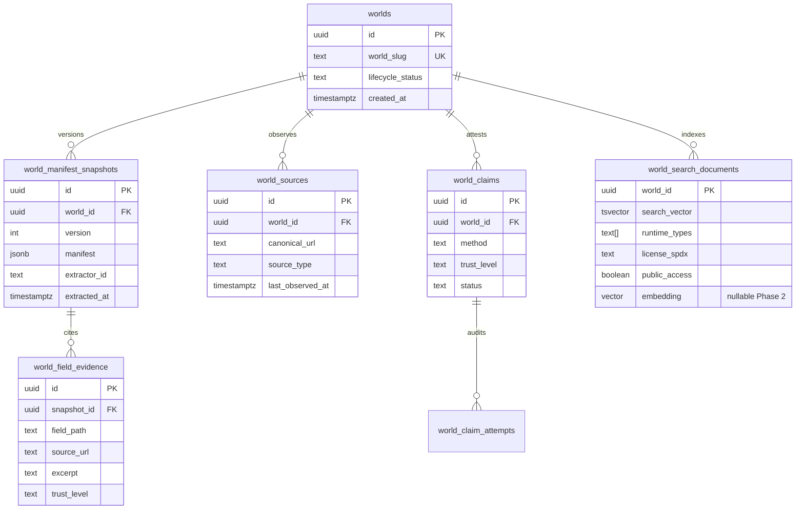
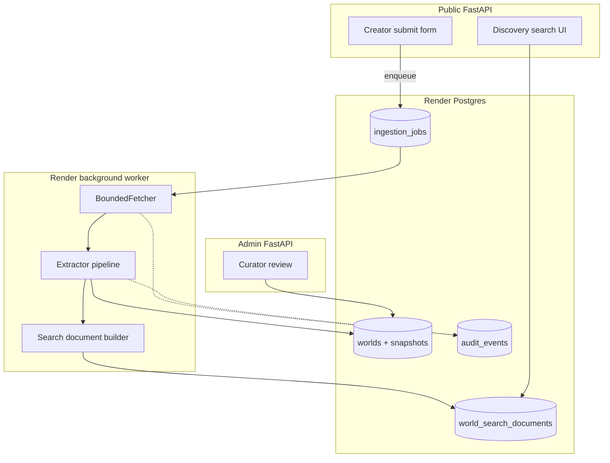
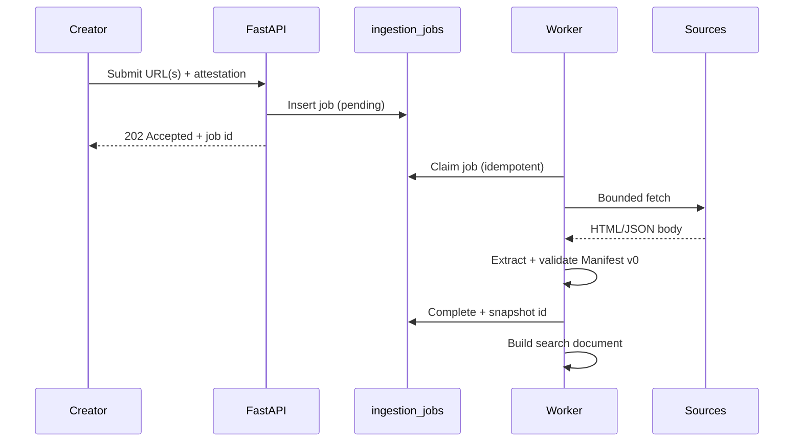

# WorldGraph technical spike (#204)

**Status:** Completed bounded spike. Evidence for implementation architecture only — no
production routes, migrations, or Render resources ship from this milestone.

**Parent issue:** [#204](https://github.com/saberistic-team/agent-web/issues/204)

**Related docs:** [MANIFEST_V0.md](./MANIFEST_V0.md), [ADR_INGESTION_AND_SEARCH.md](./ADR_INGESTION_AND_SEARCH.md),
[MARKET_POSITION.md](./MARKET_POSITION.md)

**Last updated:** 2026-07-15

---

## Executive summary

A bounded technical spike against Manifest v0 and a 18-entry research corpus (12
qualifying sources, 6 negative controls) demonstrates that:

1. **Ingestion** — A bounded fetcher with SSRF blocking, redirect limits, content-type
   caps, and robots awareness can safely process creator-provided public URLs when run
   asynchronously with fixture-backed CI and live-fetch workers.
2. **Extraction** — Deterministic parsing qualifies 12/12 corpus sources; a
   provider-neutral `Extractor` interface with Pydantic Manifest v0 validation enforces
   evidence, confidence, and unknown handling. Model-assisted extraction (stubbed) strips
   prompt-injection markers and never promotes output to `verified` provenance.
3. **Search** — PostgreSQL FTS + trigram with structured filters matches or beats
   pseudo-embedding retrieval on 7/8 benchmark queries for top-1 relevance; hybrid
   improves q05. **pgvector is not justified for Phase 1** at expected corpus scale.
4. **Verification** — Domain well-known/DNS, GitHub repo ownership, and email magic-link
   fallbacks prototype cleanly with distinct trust levels.
5. **Architecture fit** — New `world_*` tables, repository interfaces, audit events, and
   a Render background worker slot into existing FastAPI/Postgres patterns without
   overloading CRM entities.

Throwaway code lives in `app/worldgraph_spike/` (not imported by `app/main.py`).

---

## Reproducing benchmarks

```bash
# Unit + integration tests (offline fixtures)
pytest tests/test_worldgraph_spike_unit.py tests/test_worldgraph_spike_integration.py -v

# Regenerate anonymized results artifact
python -c "from app.worldgraph_spike.benchmark import write_benchmark_results; write_benchmark_results()"
```

**Inputs:**

| Artifact | Path |
|----------|------|
| Research corpus | `docs/worldgraph/research-corpus.json` |
| Fixture bodies | `tests/fixtures/worldgraph/` |
| Discovery queries | `docs/worldgraph/benchmark-queries.json` |

**Outputs:** `docs/worldgraph/benchmark-results.json` (outcomes + search metrics; full
manifest payloads omitted from the saved artifact).

### Ingestion results (deterministic extractor)

| Metric | Value |
|--------|-------|
| Total entries | 18 |
| Qualified | 14 |
| Qualifying sources tested | 12 |
| Negative controls | 6 |

| Source type | Qualifies | Notes |
|-------------|-----------|-------|
| `github_readme` | yes | Title, summary, runtime, entry, license |
| `agent_card_json` | yes | Name, description, capabilities |
| `mcp_registry_json` | yes | Registry name, homepage |
| `landing_page` | yes | Title/meta; JSON-LD variant adds description |
| `well_known_manifest` | yes | JSON at `/.well-known/` |
| `discord_bot_docs` | yes | HTML title/description |
| `hf_space_readme` | yes | README sections |
| `itch_page` | yes | HTML metadata |
| `npm_readme` | yes | Package README |
| `github_repo` | yes | Monorepo README (same parser as readme) |

**Negative controls:**

| ID | Expected | Observed |
|----|----------|----------|
| neg-001/002 | SSRF block | `SSRFBlockedError` |
| neg-003 | Unsafe scheme | `SSRFBlockedError` |
| neg-004 | Insufficient metadata | `insufficient_html_metadata` |
| neg-005 | Qualifies after injection strip | Structural qualify; model path logs warnings |
| neg-006 | Qualifies after sanitization | Script/event handlers stripped from evidence |

### Search results (same corpus, 8 queries)

| Strategy | Avg latency (offline) | No-result queries | Top-1 notes |
|----------|----------------------|-------------------|-------------|
| `fts_trigram` | 0.63 ms | 0 | Best on q02, q04, q05, q07, q08 |
| `embedding_pgvector` | 0.63 ms | 0 | False positives on q03, q05, q06 (hash stub) |
| `hybrid` | 0.61 ms | 0 | Recovers q05 top-1 vs embedding-only |

Full per-query scores: `docs/worldgraph/benchmark-results.json`.

---

## Ingestion

### Can a bounded fetcher safely process public URLs?

**Yes**, with the policy implemented in `app/worldgraph_spike/fetcher.py` and
`security.py`:

- HTTP(S) only; embedded credentials rejected
- Private/reserved IP and blocked hostnames (`localhost`, `metadata.*`, `.internal`)
- Redirect chain capped (default 3); each hop re-validated
- `content-length` and body size cap (1 MiB default)
- Allowed MIME types: HTML, plain text, markdown, JSON, JSON-LD
- Optional robots.txt gate before fetch
- Canonical URL normalization for deduplication

Live network fetch is **not** used in CI (`live_fetch_not_used_in_ci`); production
ingestion should run in a Render background worker with outbound egress controls.

### Source types with enough content

See ingestion table above. **Thin HTML shells** (neg-004) and **unstructured text**
fail qualification. JSON cards, registry entries, and structured READMEs are the
highest-signal sources.

### Creator-entered / attested minimum

| Field cluster | Minimum creator input |
|---------------|----------------------|
| Identity | World slug confirmation if auto-derived slug conflicts |
| Control | Creator name, contact, domain list for claim workflows |
| Rights | License choice when sources are ambiguous |
| Access | Public/private and age gate when not inferable |
| Entry points | Primary play URL when card/readme lacks one |

Fetched metadata alone cannot set `verified` provenance.

### Sync vs async ingestion

| Mode | Use |
|------|-----|
| Synchronous | Creator form submit acknowledgment only (<2 s); enqueue job |
| DB-backed job row | Source of truth for status, retries, idempotency key |
| Render worker | Fetch, extract, index, emit audit events |

**Recommendation:** DB job + Render worker (see ADR). Do not block HTTP requests on
fetch/extract.

---

## Extraction

### Provider-neutral interface

```python
class Extractor(ABC):
    extractor_id: str
    def extract(self, context: ExtractionContext) -> ExtractionResult: ...
```

Implementations in spike:

| ID | Role |
|----|------|
| `deterministic-v0` | Regex/JSON/HTML-LD parsing; primary for MVP |
| `model-assisted-v0-stub` | Injection defense + deterministic fallback; no live LLM |

### Deterministic vs model-assisted

| Aspect | Deterministic | Model-assisted |
|--------|---------------|----------------|
| Cost | ~$0 | ~$0.002–0.02/doc (est. small model) |
| Latency | <50 ms | 1–5 s |
| Explainability | High (pattern match) | Medium (requires evidence either way) |
| Coverage | Structured sources only | Unstructured landing copy, lore pages |
| Risk | Misses nuance | Prompt injection; hallucination |

**Spike rule:** Model output is never `verified`. Populated fields require evidence
records or `creator_declared` attestation. Validation enforced by Pydantic in
`manifest_v0.py`.

### Prompt injection defense

`strip_prompt_injection_markers()` removes common instruction-override phrases before
model path. Corpus neg-005 proves warnings are emitted. Production should also:

- Truncate context windows
- Separate system and document channels
- Reject fields whose evidence excerpt contains filtered markers

---

## Storage evaluation

Proposed tables (new namespace; CRM tables unchanged):



| Concern | Approach |
|---------|----------|
| Identity/lifecycle | `worlds` row + `lifecycle_status` (draft, published, disputed, deleted) |
| Versioned manifest | Append-only `world_manifest_snapshots` JSONB |
| Source/evidence | Normalized `world_sources` + `world_field_evidence` |
| Verification | `world_claims` + `world_claim_attempts`; never merge into evidence trust |
| Search | `world_search_documents` materialized from latest published snapshot |
| Audit | Reuse `audit_events` with `entity_type=world` |

Retention: store excerpts (≤2 KB) and canonical URLs; do not retain full HTML bodies
after extraction unless dispute hold.

---

## Search

Three strategies compared on identical documents and queries (`search.py`):

1. **FTS + trigram** — Token overlap + character trigram Jaccard; maps to
   `tsvector` + `pg_trgm` in Postgres.
2. **Embedding + pgvector** — Spike uses deterministic SHA-256 pseudo-embeddings for
   reproducibility; production would use `vector(1536)` + HNSW index.
3. **Hybrid** — `0.55 * lexical + 0.45 * vector` (weights tunable).

### Phase 1 pgvector recommendation

**Defer pgvector to Phase 2** unless corpus exceeds ~5k published worlds *and* lexical
no-result rate exceeds 15% on scout queries.

Rationale from spike:

- Corpus size MVP ≪ index overhead of HNSW + embedding refresh pipeline
- FTS+trigram achieved correct top-1 on filtered queries (q02–q04, q08)
- Pseudo-embedding produced false positives on license (q03) and nonsense (q06) queries
- Operational cost: embedding API ~$0.0001/query + worker CPU vs pure SQL

Phase 1 stack: `tsvector` + GIN, `pg_trgm` on `display_name`, structured filters on
`runtime_types`, `license_spdx`, `public_access`.

---

## Verification

Trust concepts remain **separate** (`manifest_v0.TrustLevel`):

| Concept | Trust level | Spike prototype |
|---------|-------------|-----------------|
| Source observation | `source_observation` | Fetch + extract evidence |
| Creator claim | `creator_claim` | Form attestation (not built) |
| Domain control | `domain_control` | Well-known file + DNS TXT challenge |
| Platform ownership | `platform_ownership` | GitHub repo owner match |
| Email domain | `email_domain` | Magic link (lower trust if domain mismatch) |
| Saberistic review | `saberistic_review` | Manual curator flag (not built) |

`verification.py` prototypes challenge issuance and verification for well-known,
GitHub, and email paths. Domain verification does **not** imply creator identity
without an explicit claim record.

---

## Security and operations

| Threat | Mitigation (spike / proposed) |
|--------|-------------------------------|
| SSRF / private network | URL validator blocks private IPs, metadata hosts, non-HTTP(S) |
| Redirect abuse | Per-hop validation; redirect cap |
| Oversized responses | `content-length` + body cap |
| robots / ToS | robots gate; per-source `terms_accepted_at` on job |
| Stored XSS | `sanitize_html_for_storage()` strips scripts/handlers; escape remainder |
| Prompt injection | Marker stripping; never trust model for verification |
| Poisoned metadata | Manifest validation; evidence required |
| Duplicate URLs | `canonicalize_url()`; unique index on `world_sources.canonical_url` |
| Copyright / retention | Excerpt-only storage; TTL on raw fetch blobs |
| Secrets in URLs | Reject credential-embedded URLs |
| Rate limits | Per-creator and global fetch budgets in worker |
| Retries / idempotency | Job `idempotency_key` = hash(canonical_url + extractor_version) |
| Audit | `audit_events` for ingest, claim, publish, unpublish |
| Stale data | `last_observed_at`; scheduled re-fetch jobs |
| Deletion / dispute | `lifecycle_status=disputed`; unpublish removes search doc, retains audit |

---

## Component and data-flow diagrams

### High-level components



### Ingestion job flow



---

## Preliminary API design

Spike does not register routes. Proposed MVP surface:

| Method | Path | Purpose |
|--------|------|---------|
| `POST` | `/api/worlds` | Creator intake (URLs + declarations) → job id |
| `GET` | `/api/worlds/{slug}` | Public manifest snapshot (published only) |
| `GET` | `/api/worlds/search` | Lexical search + filters |
| `POST` | `/api/worlds/{slug}/claims` | Start verification challenge |
| `POST` | `/api/worlds/{slug}/claims/{id}/verify` | Complete challenge |
| `GET` | `/admin/worlds` | Curator queue (future) |

All mutations append `audit_events`. CSRF + session auth for admin; rate-limited public
intake.

---

## Cost and operational assumptions

| Item | Phase 1 estimate (500 worlds, 1k queries/mo) |
|------|-----------------------------------------------|
| Postgres storage | <100 MB (snapshots + search docs) |
| Ingestion worker | Render worker $7–25/mo; ~2 min/world batch |
| Fetch egress | Negligible at MVP volume |
| Embedding API | $0 (deferred) |
| LLM extraction | Optional; ~$10/mo at 500 docs if enabled |
| Search query | Postgres only; sub-10 ms at MVP scale |

Reverification cron: weekly for published sources; monthly for stale claims.

---

## Recommended implementation sequence

1. **MVP PRD acceptance** — Gate before implementation issues.
2. **Schema migration** — `worlds`, snapshots, sources, jobs (no pgvector).
3. **Repository interfaces** — Mirror CRM `protocols.py` pattern.
4. **Ingestion worker** — Port spike fetcher/extractor; wire audit events.
5. **Creator intake API** — Async job enqueue only.
6. **Lexical search** — `tsvector` + trigram + filters.
7. **Claim workflows** — Well-known + GitHub first; email fallback.
8. **Admin curator UI** — Preview mode mocks per `admin_preview.py`.
9. **Phase 2 evaluation** — pgvector if corpus/no-result metrics justify.

**Do not open implementation issues until step 1 completes** (per issue acceptance).

---

## Unresolved decisions

| # | Decision | Notes |
|---|----------|-------|
| 1 | Exact Manifest v1 fields | MSF / Web of Worlds alignment TBD |
| 2 | LLM provider for assisted extract | Cost/latency vs coverage |
| 3 | Curator SLA and `saberistic_review` criteria | Ops model |
| 4 | Public search ranking signals | Recency vs verification weight |
| 5 | Dispute and DMCA workflow | Legal review |
| 6 | Cross-world relationship graph | Out of MVP scope? |
| 7 | Embedding model + dimensions | If Phase 2 pgvector approved |
| 8 | Creator billing / freemium limits | Product decision |

---

## Acceptance criteria mapping

| Criterion | Evidence |
|-----------|----------|
| ≥10 qualifying sources + negative controls | 12 + 6 in `research-corpus.json`; tests pass |
| Manifest v0 validation | `ManifestV0.model_validate` in integration test |
| Evidence or creator-declared fields | Pydantic validators + unit tests |
| Missing facts unknown | `FieldValue` unknown guard |
| Search compared on same corpus | `benchmark-results.json` |
| pgvector Phase 1 recommendation | This doc § Search; ADR |
| Claim methods / trust separated | `verification.py` + `TrustLevel` enum |
| SSRF, injection, XSS, rights, policy | `security.py` + negative controls |
| Fits FastAPI/Postgres/Render | Component diagrams; no prod routes |
| No production feature ships | `test_no_production_routes_or_migrations_added` |
| No implementation issues yet | Sequence gated on MVP PRD |

---

## Spike code map

| Module | Responsibility |
|--------|----------------|
| `manifest_v0.py` | Pydantic schema + search flattening |
| `fetcher.py` | Bounded HTTP fetch |
| `security.py` | SSRF, sanitization, injection defense |
| `extractor.py` | Deterministic + model-assisted extractors |
| `search.py` | Strategy comparison + benchmarks |
| `verification.py` | Claim challenge prototypes |
| `corpus.py` | Research corpus loader |
| `benchmark.py` | Reproducible runner |
