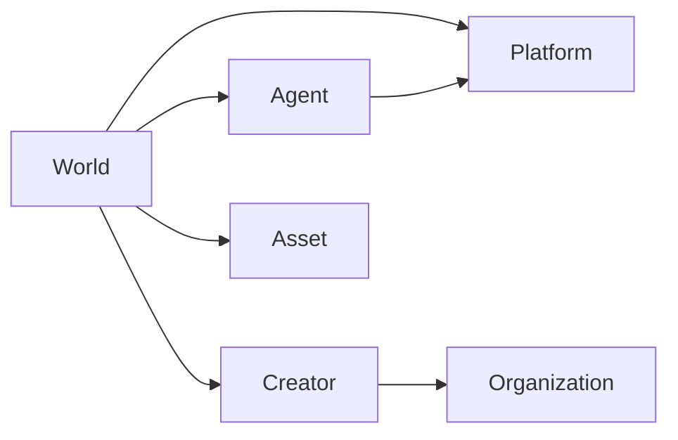

# AI-native world definition (WorldGraph)

**Parent issue:** [#199](https://github.com/saberistic-team/agent-web/issues/199)

**Status:** Canonical product definition for WorldGraph indexing. No production routes,
database tables, or public API ship from this milestone.

**Related docs:** [WORLD_MANIFEST_V0.md](./WORLD_MANIFEST_V0.md),
[world-manifest-v0.schema.json](./world-manifest-v0.schema.json),
[MARKET_POSITION.md](./MARKET_POSITION.md)

**Last updated:** 2026-07-22

---

## What WorldGraph indexes

WorldGraph indexes **Worlds** — addressable interactive systems that meet the
qualification rules below. A World is the primary graph node WorldGraph discovers,
curates, and links; it is not a catch-all bucket for every AI artifact.

Platforms, engines, agents, characters, creators, organizations, assets, and IP are
**linked entity types**. They appear in manifests and graph edges but are not
collapsed into the World entity.

---

## AI-native world (MVP definition)

An **AI-native world** is an addressable interactive system that is **persistent or
reproducible**, has a **bounded setting or rule system**, permits **users or agents to
affect outcomes**, and uses **AI materially** in the environment, characters,
narrative, simulation, or runtime behavior.

Passive AI media, generic tools, and platform products described without an
experience do not qualify as Worlds.

---

## Qualification rules

A source qualifies as a World when **all seven** criteria are satisfied. Reviewers
apply the same checklist independently; disagreement on a single criterion should
resolve to `pending_review`, not `qualifies`.

| # | Criterion | Reviewer question | Typical evidence |
|---|-----------|-------------------|------------------|
| 1 | **Stable entry point** | Is there a public or reviewable URL, repo entry, or registry record that resolves to this world today? | `identity.canonical_url`, `experience.entry_points[]` |
| 2 | **Meaningful interaction** | Can a user or agent change state, narrative, or outcomes — not only watch or read? | `experience.interaction_model`, page copy, playable demo |
| 3 | **Bounded setting or rules** | Is there lore, canon, mechanics, simulation rules, or a stated rule system? | `world_structure.setting`, `rules_or_mechanics`, README rules |
| 4 | **Persistence or reproducibility** | Is state saved, versioned, or reproducible from a config/release tag? | `experience.persistence_model`, semver, save slots, world API version |
| 5 | **Material AI role** | Is AI used in build, runtime characters, narrative, simulation, or environment — not merely mentioned in marketing? | `ai_role.material_ai_role`, runtime/build disclosures |
| 6 | **Identifiable rights claimant** | Is there a named creator, operator, org, or repo owner to contact about the world? | `identity.creator`, `identity.operator`, `identity.claimed_owner` |
| 7 | **Evaluable access and safety** | Is there enough metadata to judge entry requirements, age guidance, or moderation contact — or honestly marked unknown? | `experience.access_requirements`, `trust.safety_categories`, unknown handling |

### Qualification outcomes

| `trust.qualification_status` | Meaning |
|------------------------------|---------|
| `qualifies` | All seven criteria met with evidence or honest unknowns on optional trust fields |
| `excluded` | One or more criteria fail; set `trust.exclusion_reason` |
| `pending_review` | Ambiguous, adversarial, or insufficient evidence |

### Exclusion reasons (non-exhaustive)

| `exclusion_reason` | Fails criterion | Example |
|--------------------|-----------------|---------|
| `static_ai_media_only` | 2, 3 | Image gallery, generated video loop, prose PDF |
| `single_purpose_assistant` | 3, 4 | Chatbot with no world context or persistent state |
| `foundation_model_not_world` | 1–4 | Model card, weights repo, prompt pack without experience |
| `platform_product_not_world` | 1–3 | Engine, SDK, or hosting product marketed as a platform |
| `no_stable_entry_point` | 1 | “Coming soon” marketing with no playable or reproducible artifact |
| `marketing_only` | 1, 2 | Landing page describing a world with no entry or artifact |
| `dataset_or_tool_only` | 2, 3 | Training dataset, eval harness, or generic MCP tool |
| `unaddressable_demo` | 1 | Ephemeral demo with no stable URL or version pin |

---

## Included examples (qualify when criteria met)

| Category | Examples | Notes |
|----------|----------|-------|
| Interactive narrative | Branching story worlds, character-driven scenes | AI drives dialogue or plot branches |
| AI spatial environments | Explorable generated rooms, Marble-style worlds | Entry URL or embed with spatial interaction |
| Agent societies | Multi-agent colonies, persistent simulations | Agents affect shared world state |
| AI games and social | NPC quests, UGC arenas, multiplayer lounges | Material runtime AI behavior |
| Research simulations | Training sandboxes with agents and reproducible configs | Version-pinned configs count as reproducibility |

See [fixtures/valid/](./fixtures/valid/) for schema-valid qualifying manifests.

---

## Excluded from the World entity

These remain **out of scope** as Worlds even when AI-generated or commercially important.
They may appear as **linked assets**, **agents**, or **platforms** attached to a World.

| Excluded type | Why | Linked entity instead |
|---------------|-----|------------------------|
| Static AI images, video, audio, prose | Passive playback | Asset / IP |
| Single-purpose assistant | No bounded world context | Agent (A2A Agent Card) |
| Foundation models, prompts, datasets | Not an interactive system | Asset / Platform |
| Engines and platforms as products | Product, not a playable world | Platform |
| Unaddressable demos | No stable entry | — (do not index) |
| Marketing-only pages | No experience or artifact | — (do not index) |

See [fixtures/excluded/](./fixtures/excluded/) for schema-valid exclusion manifests.

---

## Entity types (distinct from World)

WorldGraph treats these as **separate entity types** linked from a World manifest via
`entity_links` and graph edges. Do not encode a platform or agent as if it were the
World itself.

| Entity type | Role | Typical identifiers |
|-------------|------|---------------------|
| **World** | Primary indexed interactive system | `identity.world_id`, `identity.canonical_url` |
| **Platform** | Distribution or runtime host (Roblox, Discord, custom web) | Platform name, store URL, SDK ref |
| **Agent / Character** | Autonomous or role-play entity inside a world | A2A Agent Card URL, character ID |
| **Creator / Organization** | Human or org claiming or operating the world | Name, domain, GitHub org, contact |
| **Asset / IP** | Media, model weights, lore bible, licensed IP | Asset URL, C2PA manifest, license ref |

### Relationship sketch

---

## Reviewer workflow

1. **Fetch** the canonical URL or declared entry point (async, SSRF-safe in production).
2. **Extract** manifest fields with provenance; leave gaps as `"unknown"`.
3. **Score** each of the seven criteria pass / fail / unclear.
4. **Assign** `qualification_status` and `exclusion_reason` when excluded.
5. **Never verify** unknown values — extractors and reviewers must not invent facts.

Two reviewers should reach the same outcome on the same source when evidence is
stable. When they disagree, escalate to `pending_review`.

---

## Standards and adjacent registries

WorldGraph **does not** replace A2A, MCP, C2PA, or Metaverse Standards Forum work.
World manifests **reference** those standards where overlap exists. See
[WORLD_MANIFEST_V0.md — Standards field mapping](./WORLD_MANIFEST_V0.md#standards-field-mapping).

World Manifest v0 is a **Saberistic milestone schema**, not an industry standard.

---

## Explicit decisions (#199)

| Decision | Resolution |
|----------|------------|
| Primary indexed object | World (qualified interactive system) |
| Entity separation | World, Platform, Agent/Character, Creator/Organization, Asset/IP are distinct |
| Qualification | Seven-criterion checklist with `excluded` reasons |
| Unknown values | Must remain unknown; cannot be marked verified |
| MVP publication | Economy and governance fields optional; do not block listing |
| Production implementation | Out of scope — no DB migration or public API in #199 |
